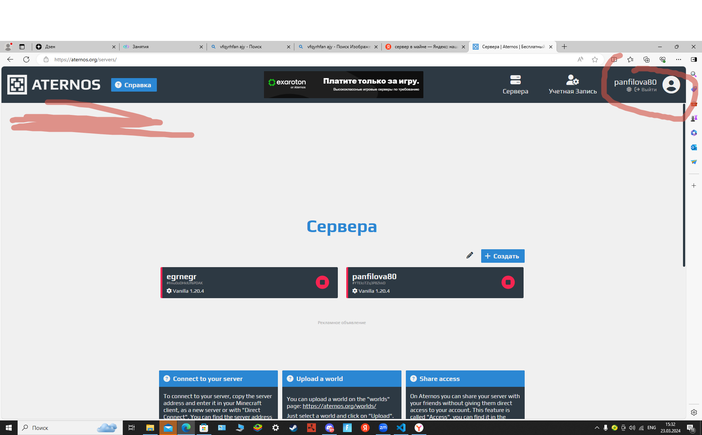
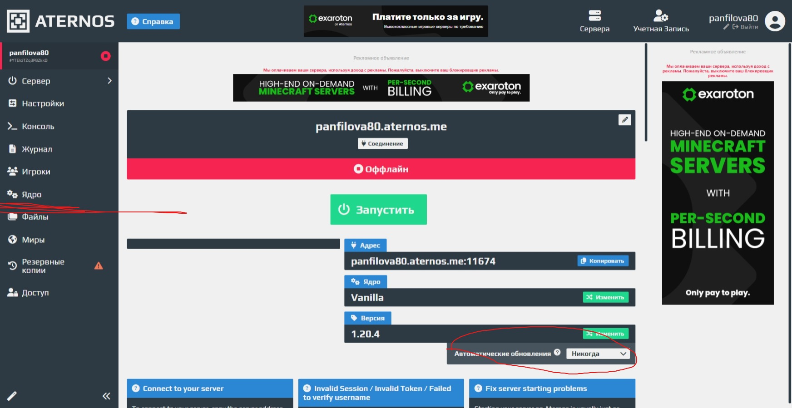
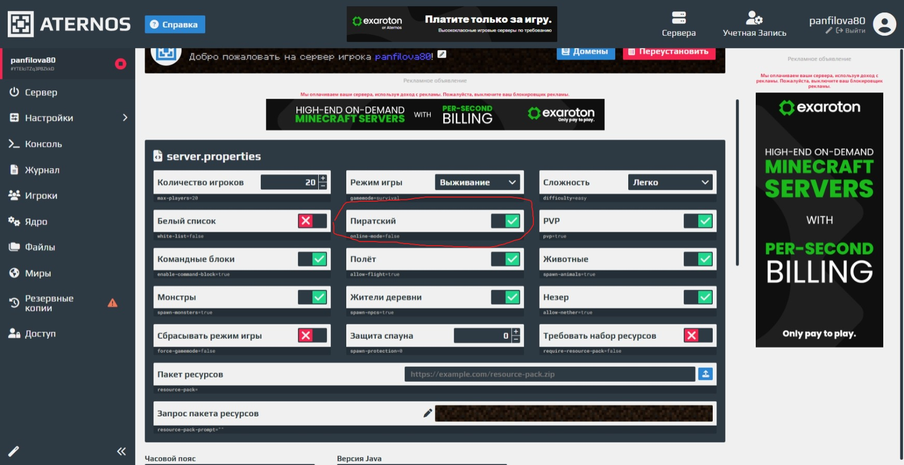
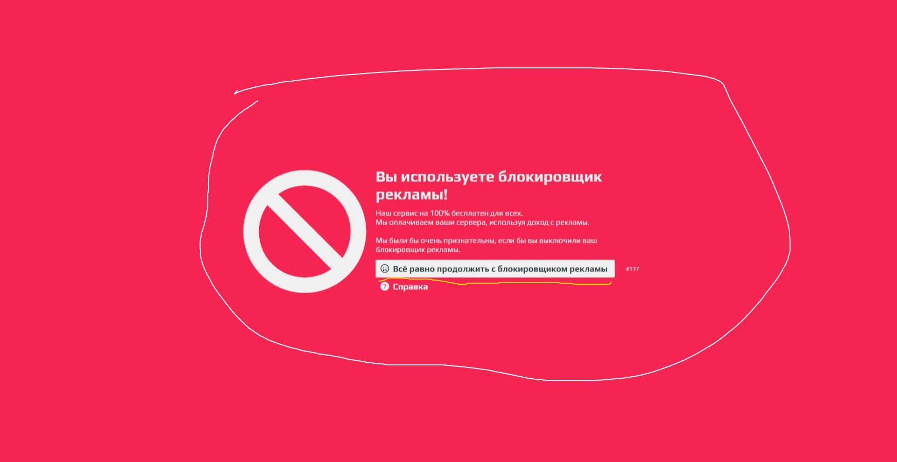

<!DOCTYPE html>
<html lang="en">
<head>
    <meta charset="UTF-8">
    <title>как создать сервер в МАЙНКРАФТЕ</title>
    <meta name="viewport" content="width=device-width, initial-scale=1.0">
    <link rel="stylesheet" href="sigma.css">
</head>
<body>
    <header>
        <h1>КАК СДЕЛАТЬ СВОЙ СЕРВЕР В МАЙНКРАФТЕ</h1>
        <a href="#inst1">ГДЕ СОЗДАТЬ</a>
        <a href="#inst">ИНСТРУКЦИЯ</a>
        <a href="#inst2">КАКИЕ МОГУТ БЫТЬ ПРОБЛЕМЫ</a>
    </header>
    <main>
        

        <h2 id="inst1">ГДЕ СОЗДАТЬ</h2>
        
Сайт на котором можно создать сервер назывется ATERNOS,вначале нужно зарегестрироваться.Это сделать не сложно.
        

        

            
            <h2 id="inst">ИНСТРУКЦИЯ</h2>
            
На этом же экране вам нужно начать на кнопку "создать"и на следущем слайде тоже.Вы можете поменять название .Потом вам нуно поставить автоматическое обновление никогда и нажать на кнопку ядро.

            
            
в отделе ядро вы выбираете ванила и подходящую версию.

            
            
Потом вы должны нажать на кнопку настройки и там настроить мир как вам удобно .И самое главное подтвердить что это будеть пиратка.

            <h2 id="inst2">Какие могут быть проблемы?</h2>
            <h3>вылезает блокировщик рекламы.</h3>
            
ничего страшного нужно просто нажать продолжить с блокировщиком рекламы

            
        

    </main>
    <footer>
        
теперь у вас есть свой сервер приятный вам игры.

    </footer>
</body>
</html>
